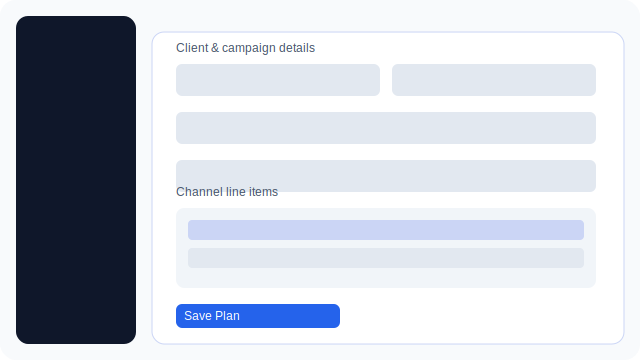

# Media Planner Webapp


A minimalist React and Tailwind CSS application providing a sidebar navigation layout.
Use the menu to switch between Dashboard, Create New Plan, and Plans sections.


## Development

```bash
npm install
npm run dev
```


## Local testing with Firebase emulators

Before deploying to Firebase Hosting you can test the app locally.

1. Install dependencies and the Firebase CLI:

   ```bash
   npm install
   npm install -g firebase-tools
   ```

2. Start the Firestore and Auth emulators (uses `firebase.json` for ports):

   ```bash
   firebase emulators:start
   ```

3. In another terminal start the Vite dev server:

   ```bash
   npm run dev
   ```


4. Open <http://localhost:5173> to use the app. If you don't define any globals,
   clicking **Continue as Guest** will automatically configure the app to use the
   local emulators with a default project ID of `demo-app`.

   To customize these settings manually, define the globals below in `index.html`
   before loading `src/main.jsx`:


   ```html
   <script>
     window.__use_emulator = true;
    window.__firebase_config = {
      projectId: 'your-project-id',
      apiKey: 'fake-api-key',
      authDomain: 'your-project-id.firebaseapp.com',
    };
    window.__app_id = 'your-project-id';

   </script>
   ```

   Replace the placeholders with any identifier you'd like. When `__use_emulator` is
   true the app connects to the local emulators instead of production services.

## Authentication

When the app loads you are presented with a login page. You can create an account,
sign in with an existing email and password, or choose **Continue as Guest** to
sign in anonymously for quick testing. The guest option now bootstraps a default

Firebase emulator configuration with placeholder `apiKey` and `authDomain`
values automatically, so you can try the app without editing `index.html` first.


## Production build

```bash
npm run build
```

## Data Model

Media plans are stored as documents with the following structure:

```
{
  client: string,
  name: string,
  totalBudget: number,
  goalKpi: string,
  campaignType: string,
  overallGoal: string,
  startDate: string,
  endDate: string,
  channels: [
    {
      name: string,
      publisher: string,
      adFormat: string,
      size: string,
      startDate: string,
      endDate: string,
      budget: number,
      demo: string,
      metric: string,
      value: number,
      mediaCommissionPct: number,
      mediaCommissionAmount: number,
      productionInstallationPct: number,
      productionInstallationAmount: number,
      daypart: string,
      spotLength: number,
      isProgrammatic: boolean,
      targetingDetails: string,
      impressionsPlanned: number,
      clicksPlanned: number,
      cpmPlanned: number,
      cpePlanned: number,
      cpcPlanned: number
    }
  ]
}
```

Additional channel details are hidden by default in the plan form and can be
revealed by expanding the respective line item.

## UI Mockups

The simplified SVG diagrams below illustrate the main screens so you can quickly

understand the layout without running the app. Click any image to open the raw
SVG file.

### Authentication Screen

[](docs/ui-mockups/authentication.svg)

### Dashboard Overview

[](docs/ui-mockups/dashboard.svg)

### Plan Builder Form

[](docs/ui-mockups/plan-builder.svg)
